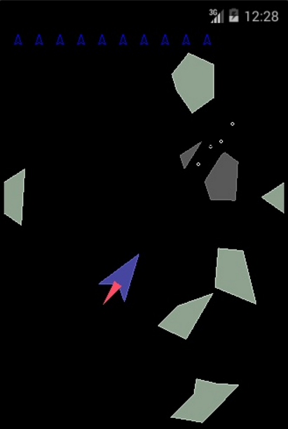

# Asteroids
Simple game for Android - classical Asteroids

Android NDK(C++), OpenGL ES, Java wrapping
- collision of asteroids processed
- when asteroid is stricken it falls apart into two parts around bullet moving line
- when asteroid strikes the ship, new asteroids formed from ship debris

**Version**

1.0
